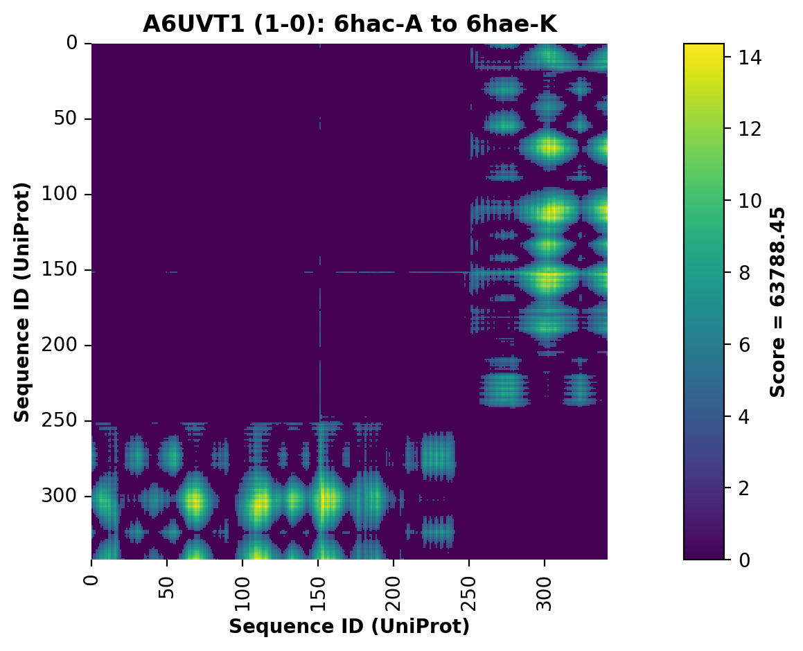
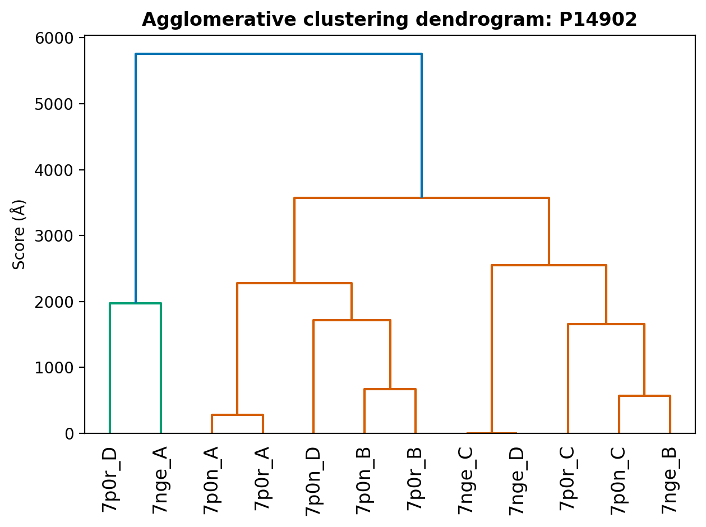
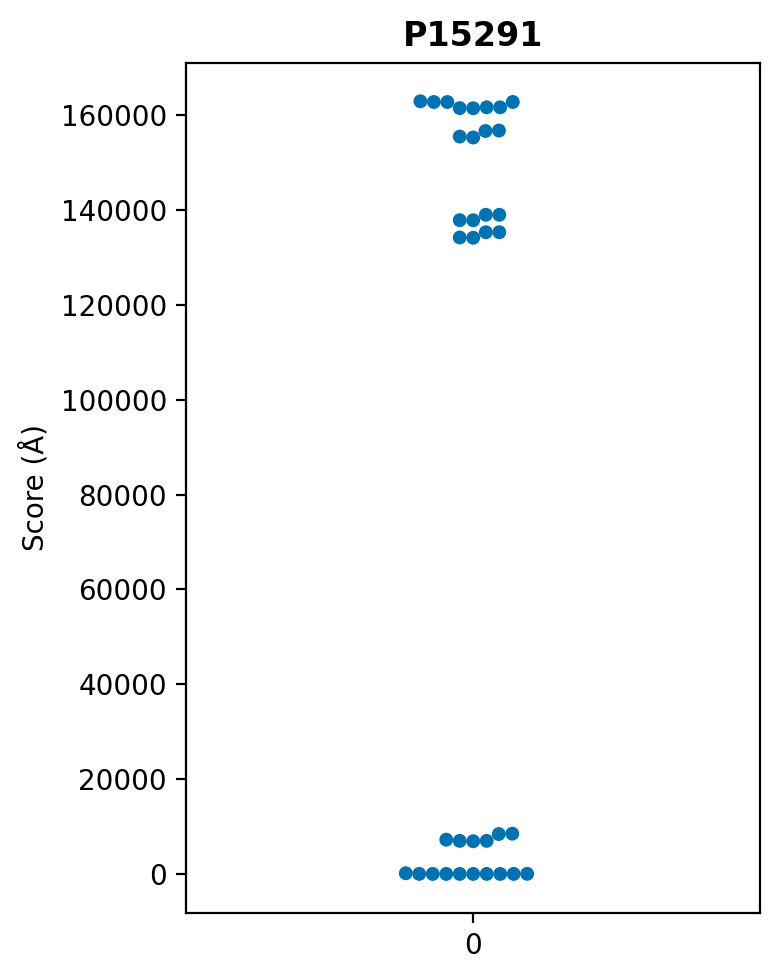

# Monomeric protein conformational state clustering

These scripts can be used to cluster a parsed set of monomeric protein chains via a global conformational change metric based on CA distances. Once the peptide chains destined for clustering have been specified, a pairwise CA distance matrix for each chain is produced. Distance difference matrices are then generated, again, pairwise but between CA distance matrices here. Therefore, for `N` unique peptide chains, `N` CA distance matrices and `N^2` distance difference matrices are generated.

Additional scripts are provided to cluster the chains based on distance-based scores calculated from all pairwise distance difference matricies, as well as scripts to produce dendrograms of the clustering results, swarm plots of the scores, and heatmaps for each distance difference matrix.

Example input data is provided in the `benchmark_data/examples` folder, including scripts to download and save data from the [PDBe-KB's benchmark conformational state dataset](http://ftp.ebi.ac.uk/pub/databases/pdbe-kb/benchmarking/distinct-monomer-conformers/). Example scripts are included in `examples`, which run complete executions of the entire pipeline for a selection of structures from several difference UniProt accessions.

For intructions on importing `protein-cluster-conformers` into your own Python code, refer to `/tutorials/instructions.ipynb`.

**Dependencies**:

`protein-cluster-conformers` requires >=Python3.10 to run. Initialise virtual environment and install dependencies with:

```shell
$ cd contact_map_difference
$ python3.10 -m venv cluster_venv
$ source cluster_venv/bin/activate
$ python -m pip install -r requirements.txt
```

_____

## CLI: Clustering structures

To cluster a set of protein structures, run the `find_clusters.py` script:

```shell
$ python find_conformers.py [-h] [-v] -u UNIPROT -m MMCIF [MMCIF ...]
							[-s PATH_CLUSTERS] -c PATH_CA [-d PATH_DD]
                          	[-g PATH_DENDROGRAM [PATH_DENDROGRAM ...]]
                          	[-w PATH_SWARM [PATH_SWARM ...]] [-o PATH_HISTOGRAM]
                          	[-a PATH_ALPHA_FOLD]
```

The following parameters can be parsed:

```shell
required arguments:
  -u UNIPROT, --uniprot UNIPROT
                        UniProt accession
  -m MMCIF [MMCIF ...], --mmcif MMCIF [MMCIF ...]
                        Enter list of paths to mmCIFs that overlap a given UniProt segment
optional arguments:
  -h, --help            show this help message and exit
  -v, --verbose         Increase verbosity
  -s PATH_CLUSTERS, --path_clusters PATH_CLUSTERS
                        Path to save clustering results
  -c PATH_CA, --path_ca PATH_CA
                        Path to save CA distance matrices
  -d PATH_DD, --path_dd PATH_DD
                        Path to save distance difference matrices
  -g PATH_DENDROGRAM [PATH_DENDROGRAM ...], --path_dendrogram PATH_DENDROGRAM [PATH_DENDROGRAM ...]
                        Path to save dendrogram of clustering results
  -w PATH_SWARM [PATH_SWARM ...], --path_swarm PATH_SWARM [PATH_SWARM ...]
                        Path to save swarm plot of scores
  -o PATH_HISTOGRAM, --path_histogram PATH_HISTOGRAM
                        Path to save histograms of distance difference maps
  -a PATH_ALPHA_FOLD, --path_alpha_fold PATH_ALPHA_FOLD
                        Path to save AlphaFold Database structure

```

---

### **Run instructions**

#### Option 1) Cluster only

To only cluster a set of monomeric protein structures that share part or all of the same UniProt sequence, run:

``` shell
$ python find_clusters.py -u "A12345" \
    -m /path/to/structure_1.cif [chains] \
    -m /path/to/structure_2.cif [chains] \
    ... \
    -m /path/to/structure_N.cif [chains] \
    -s /path/to/save/clustering/results/
```

The paths to each structure are parsed using the `-m` flag.

Chain IDs (only `struct_asym_id` is currently recognised) should be given as space-delimited arguments after the path. Parse in multiple structures using consecutive  `-m` flags. The UniProt accession must be parsed using the `-u` flag.

**Example**: O34926

```shell
$ python find_conformers.py -u "O34926" \
    -m benchmark_data/examples/O34926/O34926_updated_mmcif/3nc3_updated.cif A B \
    -m benchmark_data/examples/O34926/O34926_updated_mmcif/3nc5_updated.cif A B \
    -m benchmark_data/examples/O34926/O34926_updated_mmcif/3nc6_updated.cif A B \
    -m benchmark_data/examples/O34926/O34926_updated_mmcif/3nc7_updated.cif A B \
    -s benchmark_data/examples/O34926/O34926_cluster_results/
```

By default, the pipeline only clusters the parsed mmCIFs (and specified chains), saving clustering results to a CSV file in `-s` specified directory.

----

#### Option 2) Save matrices only

To save the matrices produced in the pipeline, simply specify the path in which to save them using the `-c` flag for CA distance matrices and the `-d` flag for CA distance difference matrices:

```shell
$ python find_clusters.py -u "A12345" \
    -m /path/to/structure_1.cif [chains] \
    -m ... \
    -s /path/to/save/cluster_results.csv \
    -c /path/to/save/CA/distance/matices \
    -d /path/to/save/distance/difference/matrices/
```

These flags are mutually exclusive, meaning either or both can be used at the same time.

**Example**: O34926

```shell
$ python find_clusters.py -u "O34926" \
    -m benchmark_data/examples/O34926/O34926_updated_mmcif/3nc3_updated.cif A B \
    -m benchmark_data/examples/O34926/O34926_updated_mmcif/3nc5_updated.cif A B \
    -m benchmark_data/examples/O34926/O34926_updated_mmcif/3nc6_updated.cif A B \
    -m benchmark_data/examples/O34926/O34926_updated_mmcif/3nc7_updated.cif A B \
    -c benchmark_data/examples/O34926_CA_distances \
    -d benchmark_data/examples/O34926_distance_differences/
```

---

#### Option 3) Render distance difference maps only

2D histograms (heatmaps) can be rendered and saved for each CA distance difference matrix by specifying the save directory using the `-o` flag:

```shell
$ python find_clusters.py -u "A12345" \
    -m /path/to/structure_1.cif [chains] \
    -m ... \
    -o /path/to/save/distance/difference/2D/histograms/
```

To save the histogram in the default directory (`test/ouputs/dd_histograms`), simply parse the `-o` flag without a path.

The resulting plots are saved in PNG format (to save render time). E.g:



<br>

**Example**: O34926

```shell
$ python run_find_clusters.py -u "O34926" \
	-m benchmark_data/examples/O34926/O34926_updated_mmcif/3nc3_updated.cif A B \
    -m benchmark_data/examples/O34926/O34926_updated_mmcif/3nc5_updated.cif A B \
    -m benchmark_data/examples/O34926/O34926_updated_mmcif/3nc6_updated.cif A B \
    -m benchmark_data/examples/O34926/O34926_updated_mmcif/3nc7_updated.cif A B \
    -o ./benchmark_data/examples/O34926/O34926_distance_difference_maps/
```

---

#### Option 4) Render dendrogram only

From the clustering results, a dendrogram can be rendered to show the relationships between all clustered chains. To save a dendrogram of the hierarchical clustering results, run:

```shell
$ python run_find_clusters.py -u "A12345" \
    -m /path/to/structure_1.cif [chains] \
    -m ... \
    -g /path/to/save/dendrogram/ [png svg]
```

where either a `png` or `svg` file type is saved. E.g.



<br>

**Example**: O34926

```shell
$ python run_find_clusters.py -u "O34926" \
	-m benchmark_data/examples/O34926/O34926_updated_mmcif/3nc3_updated.cif A B \
    -m benchmark_data/examples/O34926/O34926_updated_mmcif/3nc5_updated.cif A B \
    -m benchmark_data/examples/O34926/O34926_updated_mmcif/3nc6_updated.cif A B \
    -m benchmark_data/examples/O34926/O34926_updated_mmcif/3nc7_updated.cif A B \
    -g benchmark_data/examples/O34926/O34926_cluster_results/ png svg
```

---

#### Option 5) Render swarm plot

The scores generated between pairwise structure comparisons can be plotted as a swarm plot by parsing the `-w` flag:

```shell
$ python run_find_clusters.py -u "A12345" \
    -m /path/to/structure_1.cif [chains] \
    -m ... \
    -w /path/to/save/swarm_plot/ [png svg]
```

Like rendering the dendrogram, the swarm plot can either be saved as `png`,  `svg` or both. E.g.



<br>

**Example**: O34926

```shell
$ python find_clusters.py -u "O34926" \
    -m benchmark_data/examples/O34926/O34926_updated_mmcif/3nc3_updated.cif A B \
    -m benchmark_data/examples/O34926/O34926_updated_mmcif/3nc5_updated.cif A B \
    -m benchmark_data/examples/O34926/O34926_updated_mmcif/3nc6_updated.cif A B \
    -m benchmark_data/examples/O34926/O34926_updated_mmcif/3nc7_updated.cif A B \
    -w benchmark_data/examples/O34926/O34926_cluster_results/ png svg
```

------

#### Option 6) Include AlphaFold Database structure(s)

By parsing in the `-a` flag,  the script will attempt to download and cluster the pre-generated AlphaFold structure, stored on the [AlphaFold Database](https://alphafold.ebi.ac.uk/). You do not need to have downloaded the predicted AlphaFold structure already but must be connected to the internet. The structure will be saved

```shell
$ python find_clusters.py -u "A12345" \
		-m /path/to/structure_1.cif [chains] \
    -m ... \
    -a
```

**Example**: O34926

```shell
$ python find_clusters.py -u "O34926" \
    -m benchmark_data/examples/O34926/O34926_updated_mmcif/3nc3_updated.cif A B \
    -m benchmark_data/examples/O34926/O34926_updated_mmcif/3nc5_updated.cif A B \
    -m benchmark_data/examples/O34926/O34926_updated_mmcif/3nc6_updated.cif A B \
    -m benchmark_data/examples/O34926/O34926_updated_mmcif/3nc7_updated.cif A B \
    -a
```

------

#### **Option 7) Run all**

**Example #1:** O34926

```shell
$ python find_conformers.py -u "O34926" \
    -m benchmark_data/examples/O34926/O34926_updated_mmcif/3nc3_updated.cif A B \
    -m benchmark_data/examples/O34926/O34926_updated_mmcif/3nc5_updated.cif A B \
    -m benchmark_data/examples/O34926/O34926_updated_mmcif/3nc6_updated.cif A B \
    -m benchmark_data/examples/O34926/O34926_updated_mmcif/3nc7_updated.cif A B \
    -c benchmark_data/examples/O34926/O34926_ca_distances/ \
    -d benchmark_data/examples/O34926/O34926_distance_differences/ \
    -s benchmark_data/examples/O34926/O34926_cluster_results/ \
    -o benchmark_data/examples/O34926/O34926_distance_difference_maps/ \
    -g benchmark_data/examples/O34926/O34926_cluster_results/ png svg
    -a
```

or use the `run_O34926.sh` script.

``` shell
$ ./run_O34926.sh
```

**Example #2:** P15291

``` shell
python3 run_find_conformers.py -u "P15291" \
    -m benchmark_data/examples/P15291/P15291_updated_mmcif/2fy7_updated.cif A \
    -m benchmark_data/examples/P15291/P15291_updated_mmcif/2fya_updated.cif A \
    -m benchmark_data/examples/P15291/P15291_updated_mmcif/2fyb_updated.cif A \
    -m benchmark_data/examples/P15291/P15291_updated_mmcif/6fwu_updated.cif A B \
    -m benchmark_data/examples/P15291/P15291_updated_mmcif/2fyc_updated.cif A B \
    -m benchmark_data/examples/P15291/P15291_updated_mmcif/2fyd_updated.cif A B \
    -c benchmark_data/examples/P15291/P15291_ca_distances/ \
    -d benchmark_data/examples/P15291/P15291_distance_differences/ \
    -s benchmark_data/examples/P15291/P15291_cluster_results/ \
    -o benchmark_data/examples/P15291/P15291_distance_difference_maps/ \
    -g benchmark_data/examples/P15291/P15291_cluster_results/ png svg
    -w benchmark_data/examples/P15291/P15291_cluster_results/ png svg
    -a
```

or execute the `run_P15291.sh` script.

```shell
$ ./run_P15291.sh
```

When imported into Orc, the arguments required to execute the clustering process correctly will be parsed into the class instance and related methods as lists generated from the preceding functions called by the existing `protein-superpose` pipeline.

---

### Run on benchmark dataset

The scripts above are called by the `run_benchmark.py` wrapper. To generate conformational clustering results for the included benchmark dataset, run:

``` shell
$ python cluster_benchmark.py
```

This will call the `run_benchmark(...)` functions included in `ca_distance.py`, `distance_difference.py`, `cluster.py`, `plot_distance_difference.py`, `plot_dendrogram.py` and `plot_swarm_plot.py`. No arguments need parsing into the script.

Results will be saved in the `./benchmark_data/` folder.

------

## Contributing

Install developer dependencies:

```shell
pip install -r dev-requirements.txt
```

To run unit tests on the package, the Pytest framework is recommented and can be performed with:

```shell
pytest --cov=cluster_conformers --cov-report=html -v
```

The following dependencies will be required:

- `pytest-cov`
- `pytest-forked`
- `purest-xdist` (optional)

They are installed along with the main package dependencies in `requirements.txt`.
